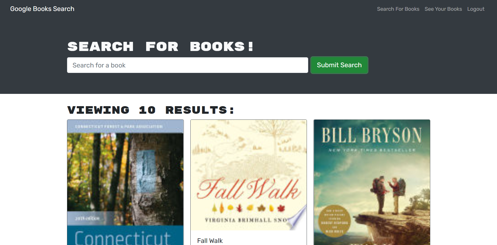

# Reading Track

## Description

Reading Track is a Google Books API and GraphQL application that allows users to create an account and search for books and add them to their reading list. If a user logs out and then logs back in their reading list will still be available.

## Table of contents

- [Installation](#Installation)
- [Usage](#Usage)
- [License](#License)
- [Contributing](#Contributing)
- [Tests](#Tests)
- [Questions](#Questions)

## Installation

Reading Track does not require installation. Users can engage with the Reading Track application where it is deployed online at the following URL:

<https://jasonarritt-reading-track.herokuapp.com/>

## Usage

Upon starting/navigating to the Reading Track application, the user is presented with a page that allows them to enter a search term for finding a book. From the search results page, the user can select a book to save to their reading list.

## License

Copyright 2022 jasonarritt

      Permission is hereby granted, free of charge, to any person obtaining a copy of this software and associated documentation files (the "Software"), to deal in the Software without restriction, including without limitation the rights to use, copy, modify, merge, publish, distribute, sublicense, and/or sell copies of the Software, and to permit persons to whom the Software is furnished to do so, subject to the following conditions:

      The above copyright notice and this permission notice shall be included in all copies or substantial portions of the Software.

      THE SOFTWARE IS PROVIDED "AS IS", WITHOUT WARRANTY OF ANY KIND, EXPRESS OR IMPLIED, INCLUDING BUT NOT LIMITED TO THE WARRANTIES OF MERCHANTABILITY, FITNESS FOR A PARTICULAR PURPOSE AND NONINFRINGEMENT. IN NO EVENT SHALL THE AUTHORS OR COPYRIGHT HOLDERS BE LIABLE FOR ANY CLAIM, DAMAGES OR OTHER LIABILITY, WHETHER IN AN ACTION OF CONTRACT, TORT OR OTHERWISE, ARISING FROM, OUT OF OR IN CONNECTION WITH THE SOFTWARE OR THE USE OR OTHER DEALINGS IN THE SOFTWARE.

<https://opensource.org/licenses/MIT/>

## Contributing

Those who would like to contribute can reach out to the email address provided in the Questions section below.

## Tests

No tests have been written for the Reading Track application.

## Questions

GitHub is located at <https://github.com/jasonarritt/>.

If you have questions, please contact jason.a.arritt@gmail.com.

This README.md was generated using README.md Doctor.
Copyright 2022.
